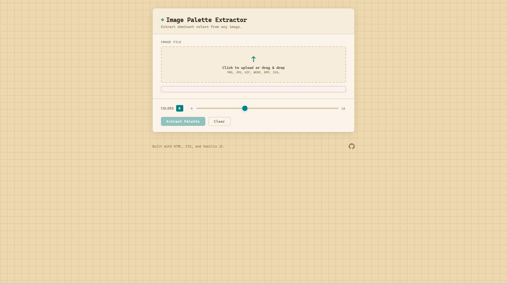

# Image Palette Extraction Tool

A simple web application that extracts dominant color palettes from user-uploaded images. Built with HTML, CSS, and vanilla JavaScript to explore browser-based image processing and dynamic UI updates.

## Features
- Upload an image directly from the browser
- Extract a dominant color palette automatically
- Adjust palette size from 4 to 16 colors
- Display extracted colors interactively for quick visual reference

## How It Works
- Loads an uploaded image into the browser
- Reads pixel-level RGB data from the image
- Identifies frequently occurring colors to generate a dominant palette
- Updates the interface dynamically to display the selected colors

## Technical Concepts
- DOM manipulation
- Browser-based file handling
- Pixel-level RGB data processing
- Dynamic UI updates

## Project Structure
- `index.html` — app layout and upload interface
- `style.css` — styling and responsive layout
- `script.js` — image processing and palette extraction logic
- `assets/` — screenshots or demo GIFs

## Preview

## Live Page

https://jsooonx.github.io/image-palette-extractor/

## Technologies
- HTML
- CSS
- JavaScript

## Implementation Insight
This project processes pixel-level RGB data from uploaded images in the browser, computes frequently occurring color patterns, and dynamically renders a dominant palette using JavaScript and DOM manipulation.
